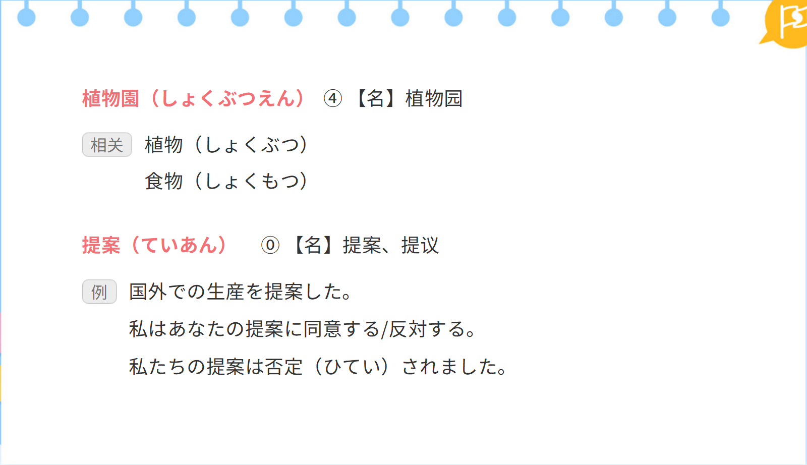
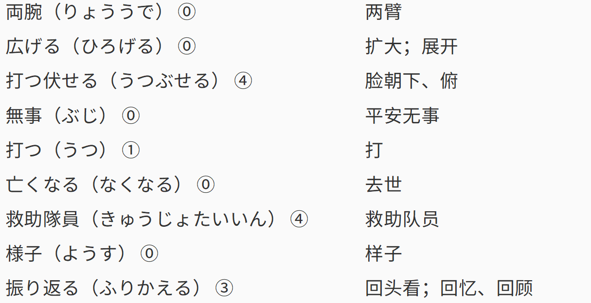
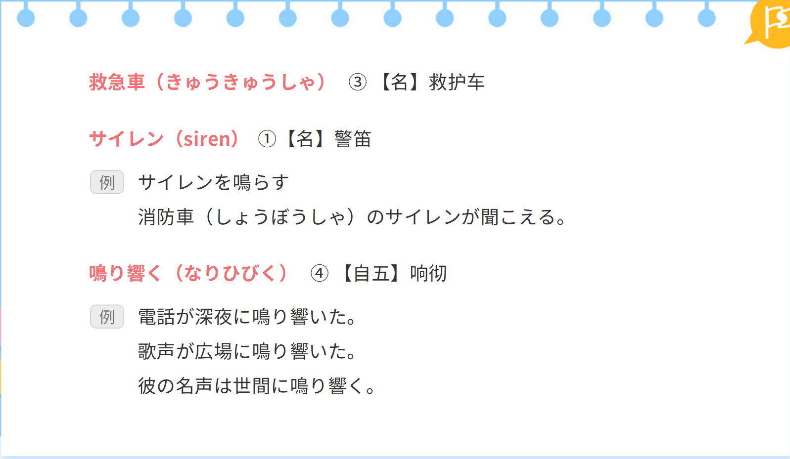
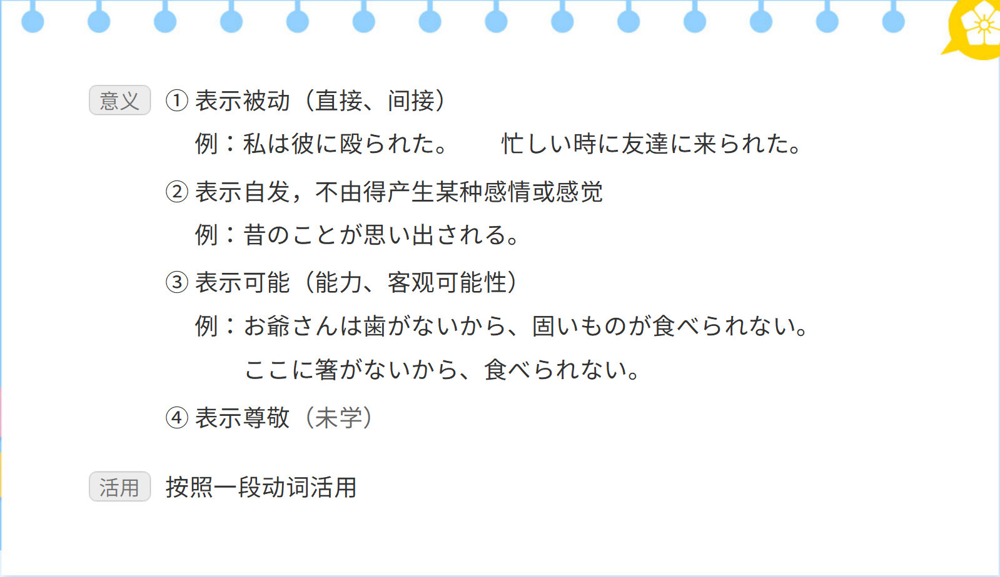
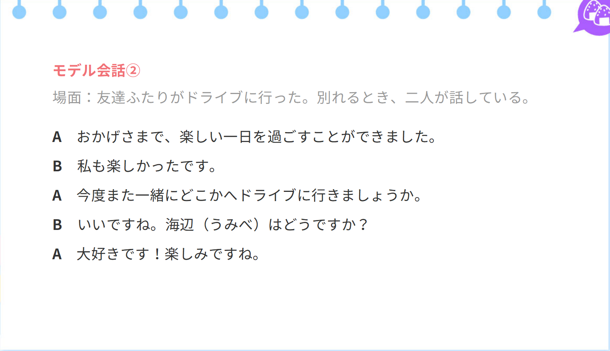

## 单词
### 前文单词

### 课文单词

### 读解文单词

## 语法
### 语调（イントネーション）

### 形容动词的活用

### 助动词

#### 希望助动词「たい、たがる」

#### 推量助动词「らしい」

#### 样态助动词「そうだ」

#### 比况助动词「ようだ、みたいだ」

#### 传闻助动词「そうだ」

#### 断定助动词「だ・です」

#### 敬体助动词「ます」

#### 否定助动词「ない、ぬ（ん）（未学）」

#### 过去完了助动词「た」

#### 意志推量助动词「う・よう」

#### 推量助动词「べし」 否定意志推量助动词「まい」

#### 被动、自发、可能、尊敬助动词「れる、られる」

#### 使役助动词「せる」「させる」

#### 助动词按词形活用分类

### 补助动词

### 助词

### 句型

## 课文
### 前文

### 实用短句

### 读解文

### 功能用语

