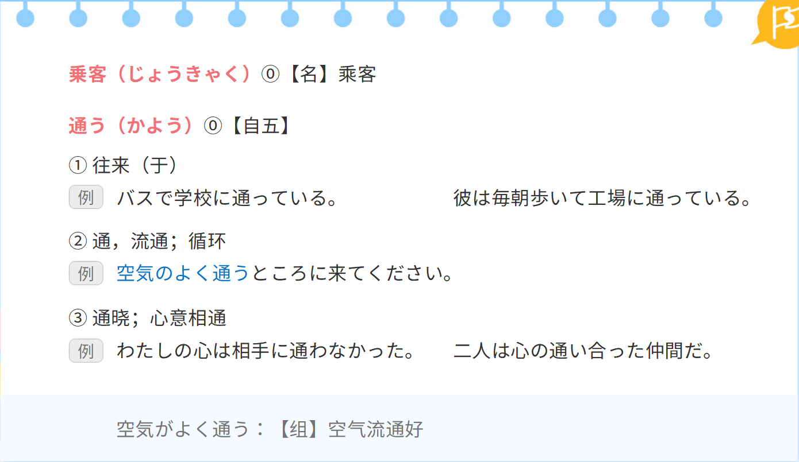
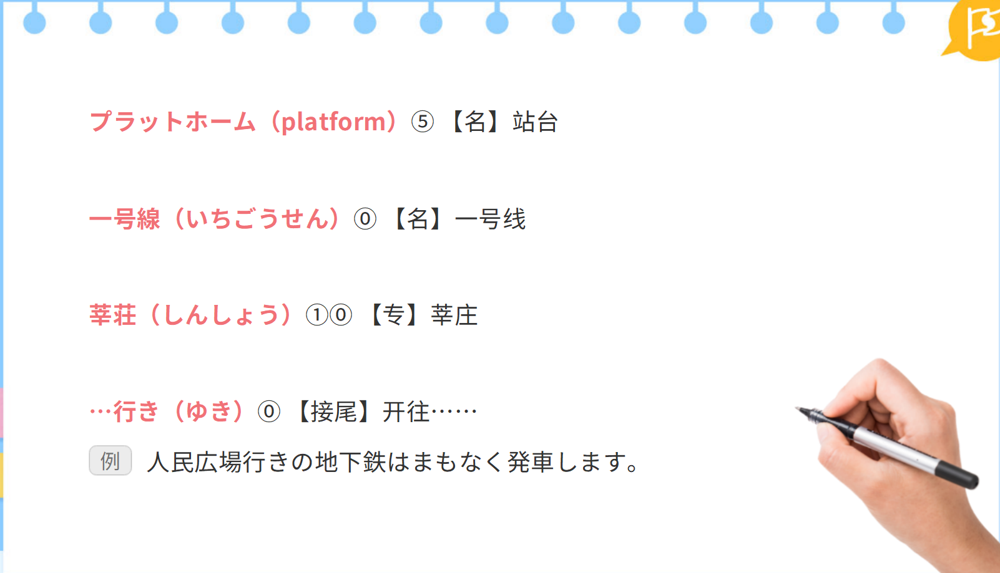
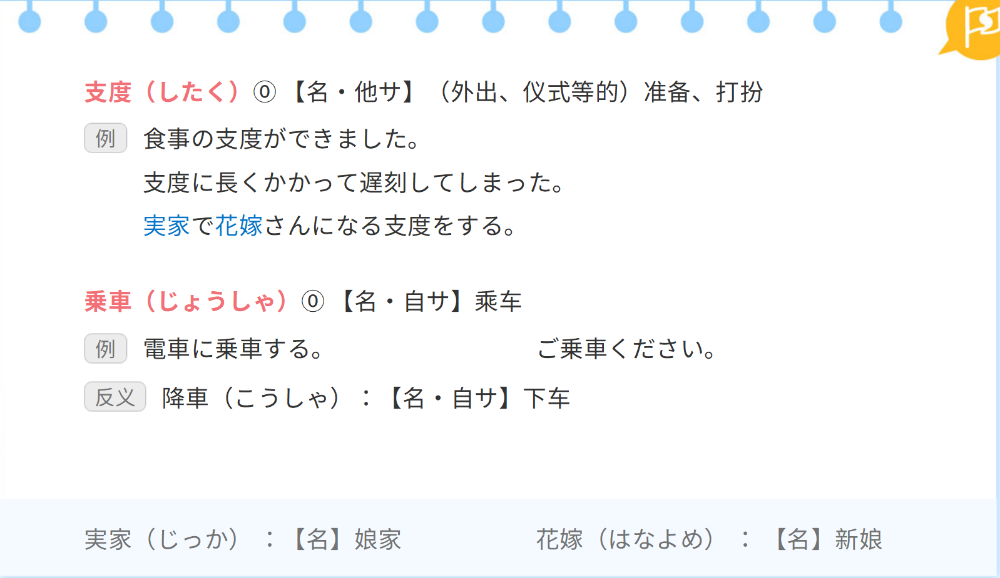
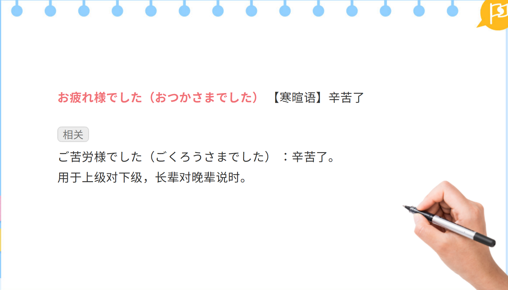
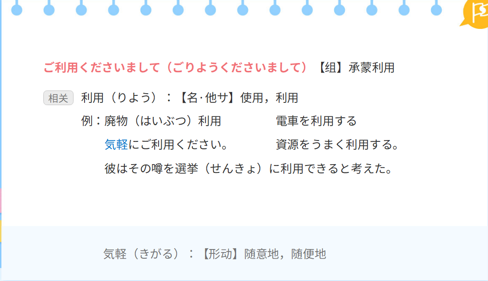
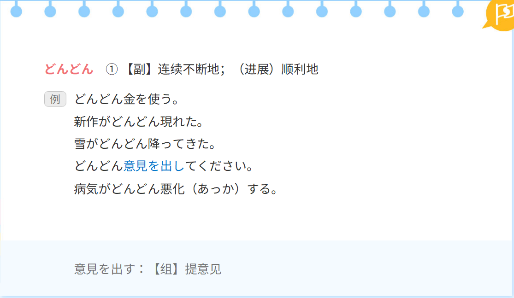
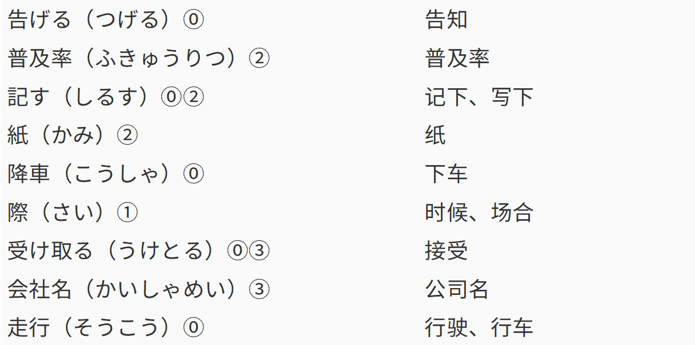
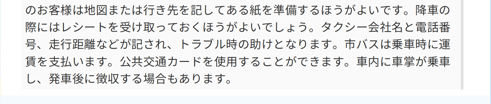
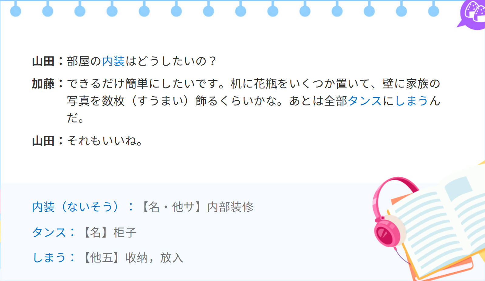

## 单词
### 前文单词

### 课文单词

### 读解文单词

## 语法
### 「する」表示时间的经过

### 动词的名词法

### 补助动词「いく」和「くる」

### 「いたす」表示自谦

### 动词连用形+ておる

### 「ように」表示目的、要求、希望等

### …ほど…ない 「…ほど…はない」

### いくら…ても

### なかなか…ない

###  さえ

## 课文
### 前文

### 实用短句

### 读解文

### 功能用语

