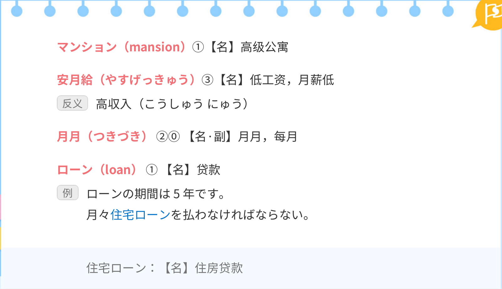
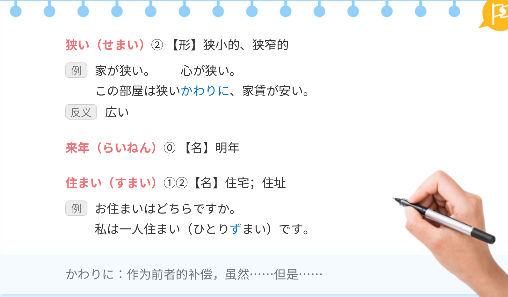
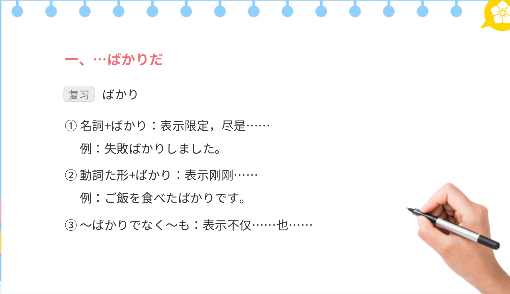

## 单词
### 前文单词

### 课文单词

### 读解文单词

## 语法
### …ばかりだ 

### 「する」（金额）

### もちろん

### …（の）ではないでしょうか

### じゃありませんか 

### ことで

### かわりに

### だけでなく…も

### まで

## 课文
### 前文

### 实用短句

### 读解文

### 功能用语

