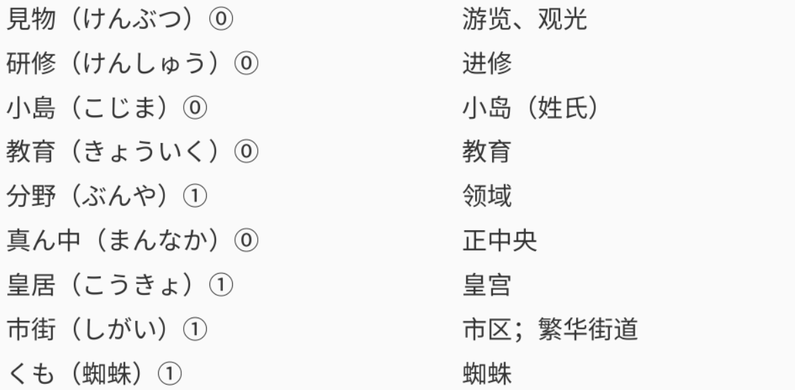
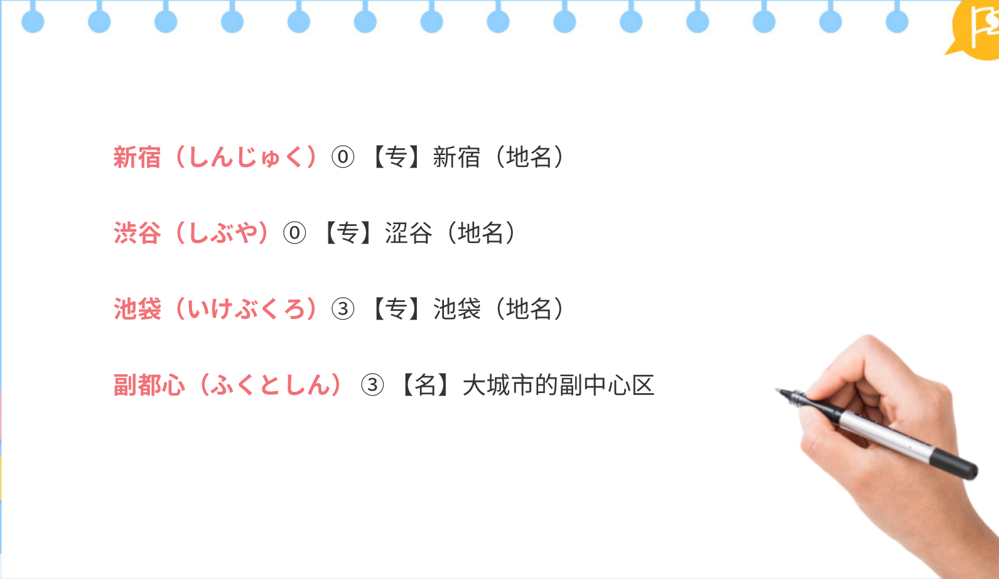

## 单词
### 前文单词

### 课文单词

### 读解文单词

## 语法
### …ばかりで（は）なく、…も

### …として

### 接尾词「らしい」

### 「…てほしい」表示希望

### …と言われている

### …も…ば、…も…

### 副助词「まで」表示范围

### までに

### 副词「あまり」后续肯定

###  「って」表示「と」「という」或「というのは」

## 课文
### 前文

### 实用短句

### 读解文

### 功能用语

